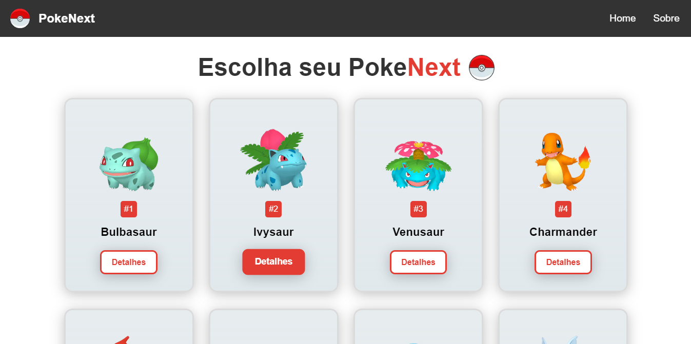

<h1 align="center"> PokeNext </h1>

  <a href="#-tecnologias">Tecnologias</a>&nbsp;&nbsp;&nbsp;|&nbsp;&nbsp;&nbsp;
  <a href="#-projeto">Projeto</a>&nbsp;&nbsp;&nbsp;|&nbsp;&nbsp;&nbsp;
  <a href="#memo-licença">Licença</a>

  

 

  

## 🚀 Tecnologias

Esse projeto foi desenvolvido com as seguintes tecnologias:

- Nextjs
- React
- API Request
- HTML e CSS
- JavaScript

## 💻 Projeto

PokeNext é uma pokédex que apresenta os dados de mais de 250 Pokémons. O projeto foi desenvolvido em Next.js e consome a api PokéApi e as imagens foram retiradas do repositório de sprites da PokéApi.

## :memo: Licença

Esse projeto está sob a licença MIT.

---

Feito com ♥ by Luiz :wave:
